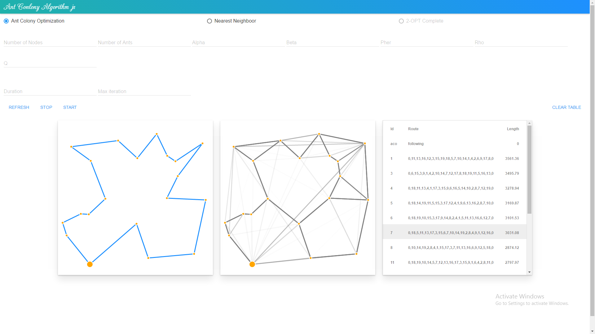

Ant Colony Optimization
=======================

Giới thiệu
----------

Là một trong những thuật toán đại diện cho Swarm Intelligence được Marco Dorigo đề xuất vào năm 1992

Thường Ant Colony Optimization (ACO) được gọi là một nhánh thuật toán vì cũng có khá nhiều thuật toán mở rộng khác nhau được xây dựng trên nền thuật toán này. Bản thân Ant Colony Optimization cũng được xây dựng trên nền mô hình Ant System nhưng được phát triển với mục đích riêng là giải quyết bài toán trên đồ thị

Các thuật toán mở rộng có thể kể đến đó là:

- Max-min ant system (MMAS)

- Ant colony system

- Rank-based ant system (ASrank)

- Continuous orthogonal ant colony (COAC)

Pseudocode
----------

> Nguồn: Wikipedia

```
procedure ACO_MetaHeuristic
    while(not_termination)
        generateSolutions()
        daemonActions()
        pheromoneUpdate()
    end while
end procedure
```

Mô tả
-----

Thuật toán tận dụng thế mạnh của thuật toán ngẫu nhiên kết hợp với thuật toán tìm kiếm cục bộ để giải các bài toán

Tổng quan bài toán gồm các bước như sau:

1. Khởi tạo trọng số trên các tuyến đường

2. Thực hiện một số lần hữu hạn các vòng lặp

  - Đưa ra một loạt các kết quả thông qua việc tìm kiếm cục bộ kết hợp với tìm kiếm ngẫu nhiên trên đồ thị

  - Chọn ra tuyến đường tốt nhất và cập nhật

  - Cập nhật lại trọng số trên đồ thị dựa vào kết quả thu được


Đối với bài toán cụ thể là Travelling Salesman Problem trọng số phụ thuộc vào hai yếu tố đó là pheromone và độ dài tuyến đường.

Ban đầu pheromone chưa biết ta có thể khởi tạo pheromone bằng nhau. Bài toán giống với Nearest Neighbor (NN). Tuy nhiên điểm khác giữa ACO và Nearest Neighbor là Nearest Neighbor sẽ chọn điểm gần nhất tại mỗi điểm, ACO không chọn cạnh có trọng số lớn nhất để đi luôn mà nó sẽ chọn ngẫu nhiên theo xác suất. Cạnh nào có trọng số lớn hơn thì xác suất được chọn lớn hơn

Sau mỗi vòng lặp pheromone trên các cạnh sẽ bay hơi một phần. Kiến cũng để lại pheromone trên các cạnh mà nó đi qua dựa vào đánh giá của nó về chi phí của tuyến đường.

So sánh với NN
--------------

Việc lựa chọn ngẫu nhiên các cạnh khiến cho ACO trông có vẻ bất lợi hơn thuật toán NN. Tuy nhiên trong một vòng lặp, ACO không chỉ đưa ra một kết quả mà cho nhiều con kiến đi để tìm ra các kết quả khác nhau. Điều này giúp cho ACO lợi thế hơn thuật toán NN là chỉ tìm ra quãng đường có chi phí cục bộ

Ngoài ra việc cập nhật pheromone trên các tuyến đường giúp cho thuật toán ACO có khả năng thay đổi trọng số các cạnh, đánh giá tuyến đường và tối ưu hóa.

Chúng ta cũng có thể sử dụng ACO để tìm ra nhiều tuyến đường khác nhau mà chi phí tương đương nhau

Việc giải bài toán bằng thuật toán ACO có thể được ví như `việc để mọi thứ diên ra theo tự nhiên`

Nhược điểm của ACO là nếu chỉ xét trên bài toán Travelling Salesman Problem thì đối với NN hay 2OPT việc code ACO sẽ phức tạp hơn mà hiệu quả hơn không đáng kể

Đối với kích thước bài toán to hơn thì hiệu năng của thuật toán cũng giảm đáng kể và yêu cầu tài nguyên cũng tăng cao

Một số thuật toán mở rộng có thể giúp mở rộng thuật toán đối với những bài toán lớn hơn như Ant Colony System nhưng cũng yêu cầu thuật toán phức tạp hơn

Chương trình demo
-----------------

### Giới thiệu

Chương trình là demo của thuật toán Ant Colony Optimization (ACO) trên nền bài toán Travelling Salesman Problem (TSP)

Bên cạnh đó chương trình cũng lấy hai thuật toán là Nearest Neighbor (NN) và 2-OPT Complete để làm tiêu chuẩn so sánh

Demo được xây dựng dựa trên demo [aco-js] của GordyD


### Giao diện chính của chương trình



### Lựa chọn thuật toán


Các giá trị cài đặt cho thuật toán ACO


Nếu bị bỏ trống chương trình sẽ chạy với các giá trị mặc định sau

```
+ Số đỉnh: 20
+ Số con kiến: 20
+ Alpha: 1, Beta: 1
+ Rho: 0.1
+ Q: 100

+ Iteration: 200
+ Duration: 100
```

### Hiển thị kết quả


Phần hiển thị kết quả gồm có 3 ô với nhiệm vụ của từng khung là:
  - Ô bên trái hiển thị tuyến đường.
  - Ô ở giữa hiển thị giá trị pheromone trên các tuyến đường.
  - Ô bên phải là bảng các tuyến đường và chi phí tương ứng.

Ta có thể kích vào dòng bất kì để hiển thị lại tuyến đường của dòng đó.

### Các phím chức năng

- **Refresh**: Khởi tạo lại sử dụng khi số đỉnh thay đổi
- **Stop**: Dừng lại sử dụng khi thuật toán ACO chạy quá lâu
- **Start**: Để bắt đầu thực hiện Demo

- **Clear Table**: Xóa bảng lưu trữ tuyến đường khi bảng quá dài và chứa nhiều dữ liệu cũ

Tài liệu tham khảo
------------------

Research Gate:

- **High-level pseudo-code for the ACO algorithm**: https://www.researchgate.net/figure/5842413_fig2_Figure-3-High-level-pseudo-code-for-the-ACO-algorithm

- **Using Ant Colony Optimization (ACO) on Kinetic Modeling of the Acetoin Production in Lactococcus Lactis C7**: https://www.researchgate.net/figure/237013254_fig1_Fig-1-Pyruvate-metabolisms-in-lactococcus-lactis-C7-Marcel-et-al-2002

Wikipedia:

- **Ant**: https://en.wikipedia.org/wiki/Ant

- **Travelling salesman problem**: https://en.wikipedia.org/wiki/Travelling_salesman_problem

- **Ant colony optimization algorithms**: https://en.wikipedia.org/wiki/Ant_colony_optimization_algorithms

Source-code:

- **aco-metaheuristic**: www.aco-metaheuristic.org/aco-code/

- **aco-js**: https://github.com/GordyD/js-aco